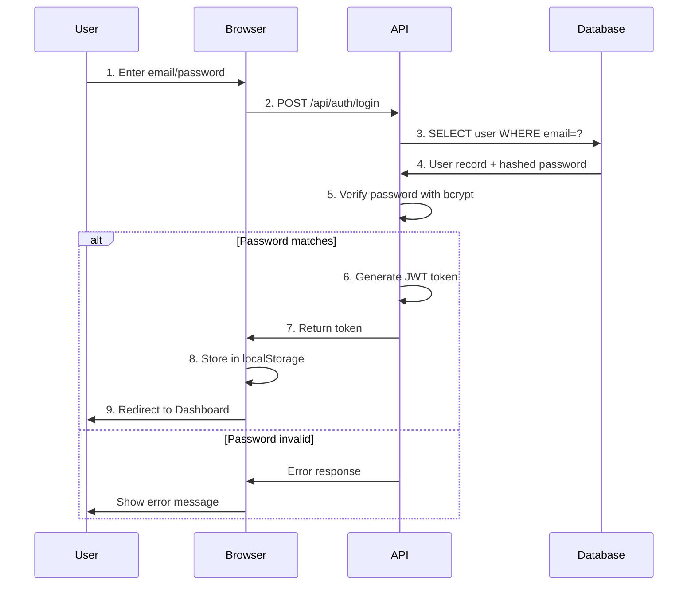

# ICOE Architecture

## System Overview

ICOE (In Case Of Emergency) is a **3-tier web application** designed for family emergency information management with a focus on personal reassurance, security, simplicity, and local-first data storage.

### Architecture Diagram


---

## Technology Stack

### Frontend Layer
- **Framework**: React 18
- **Language**: JavaScript (ES6+)
- **Styling**: CSS3 (modern flexbox/grid)
- **HTTP Client**: Fetch API (built-in)
- **State Management**: React hooks (useState, useEffect)

### Backend Layer
- **Runtime**: Node.js (v14+)
- **Framework**: Express.js
- **Authentication**: JWT (JSON Web Tokens)
- **Password Security**: bcryptjs
- **File Handling**: Multer
- **CORS**: Enabled for cross-origin requests

### Data Layer
- **Database**: SQLite3 (file-based, no server needed)
- **File Storage**: Local filesystem (backend/uploads)
- **Database Location**: `backend/mbb.db`

---

## Communication Flow

### Data Flow (Client → Server → Database)

```
User Action (Frontend)
    ↓
React Component State Update
    ↓
HTTP Request (Fetch API)
    ↓
Express Route Handler
    ↓
JWT Token Validation
    ↓
Business Logic
    ↓
SQLite Query
    ↓
Response (JSON)
    ↓
React State Update (Re-render)
    ↓
Updated UI
```

---

## Authentication Flow



---

## Data Access Control

### User Isolation
- All queries filter by `user_id`
- Users can only access their own data
- File access linked through item ownership

### Permission Model (Phase 1)
```
Owner:
  ✓ Create items in categories
  ✓ Edit own items
  ✓ Delete own items
  ✓ Upload/delete files
  ✓ Invite viewers

Viewer (Phase 2):
  ✓ View owner's items
  ✓ Download files
  ✗ Create/edit/delete
```

---

## API Design Principles

### RESTful Conventions
- **GET** - Retrieve resource(s)
- **POST** - Create new resource
- **PUT** - Update existing resource
- **DELETE** - Remove resource

### Response Format
```json
{
  "id": 1,
  "message": "Success description" | null,
  "data": { } | [ ] | null,
  "error": "Error description" | null
}
```

### Error Handling
- `400` Bad Request - Missing/invalid fields
- `401` Unauthorized - Missing token
- `403` Forbidden - Invalid token
- `404` Not Found - Resource doesn't exist
- `500` Server Error - Unexpected error

---

## Deployment Architecture (Future)

```
┌─────────────────────────────────────┐
│         Internet / Users            │
└──────────────────┬──────────────────┘
                   │
        ┌──────────┴──────────┐
        │                     │
    ┌───▼────┐            ┌──▼────┐
    │  CDN   │            │ LB    │
    └───┬────┘            └──┬────┘
        │                    │
        └──────────┬─────────┘
                   │
        ┌──────────┴──────────┐
        │                     │
    ┌───▼─────┐           ┌──▼──────┐
    │Frontend  │           │Backend  │
    │(React)   │           │(Node.js)│
    └──────────┘           └──┬──────┘
                              │
                           ┌──▼──────┐
                           │Database  │
                           │(SQLite→  │
                           │ PostgreSQL)
                           └──────────┘
```

---

## Security Considerations

### Phase 1 - Local Development
- ✓ JWT token-based auth
- ✓ Hashed passwords (bcrypt)
- ✓ CORS enabled for localhost
- ⚠️ No HTTPS (local only)
- ⚠️ Basic file upload validation

### Phase 2 - Production
- [ ] HTTPS/TLS encryption
- [ ] Rate limiting
- [ ] File type validation
- [ ] Virus scanning for uploads
- [ ] Database encryption at rest
- [ ] API key rotation
- [ ] Audit logging

---

## Performance Considerations

### Current Optimizations
- SQLite indexes on frequently queried columns
- JWT token expiration (24 hours)
- File size limits on upload
- Lazy loading of items in categories

### Future Optimizations
- Database pagination
- Image/file compression
- React code splitting
- Service Worker caching
- CDN for static assets
- Database query optimization

---

## Scalability Path

### Phase 1 (Current)
- SQLite (single user/small groups)
- Local file storage
- Single server instance

### Phase 2
- PostgreSQL migration
- AWS S3 for file storage
- Multiple API server instances with load balancer

### Phase 3
- Database replication
- API caching layer (Redis)
- Microservices architecture
- Mobile apps (iOS/Android)
