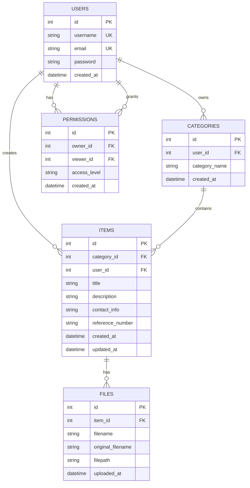

# ICON Data Models

## Entity Relationship Diagram



---

## Database Schema

### USERS Table

Stores user account information and credentials.

```sql
CREATE TABLE users (
  id INTEGER PRIMARY KEY AUTOINCREMENT,
  username TEXT UNIQUE NOT NULL,
  email TEXT UNIQUE NOT NULL,
  password TEXT NOT NULL,
  created_at DATETIME DEFAULT CURRENT_TIMESTAMP
);
```

**Fields:**
- `id` - Unique identifier
- `username` - Display name (unique)
- `email` - Login email (unique)
- `password` - Hashed password (bcrypt)
- `created_at` - Account creation timestamp

**Indexes:**
```sql
CREATE UNIQUE INDEX idx_users_email ON users(email);
CREATE UNIQUE INDEX idx_users_username ON users(username);
```

---

### CATEGORIES Table

Groups related items by type (LEGAL, HEALTH, etc.)

```sql
CREATE TABLE categories (
  id INTEGER PRIMARY KEY AUTOINCREMENT,
  user_id INTEGER NOT NULL,
  category_name TEXT NOT NULL,
  created_at DATETIME DEFAULT CURRENT_TIMESTAMP,
  FOREIGN KEY(user_id) REFERENCES users(id)
);
```

**Fields:**
- `id` - Unique identifier
- `user_id` - Owner of this category
- `category_name` - Category type (LEGAL, HEALTH, etc.)
- `created_at` - Creation timestamp

**Indexes:**
```sql
CREATE INDEX idx_categories_user_id ON categories(user_id);
CREATE UNIQUE INDEX idx_categories_user_name ON categories(user_id, category_name);
```

**Standard Categories:**
- LEGAL
- HEALTH
- FINANCE
- SERVICES
- INSURANCE
- MEMBERSHIPS

---

### ITEMS Table

Individual entries within a category.

```sql
CREATE TABLE items (
  id INTEGER PRIMARY KEY AUTOINCREMENT,
  category_id INTEGER NOT NULL,
  user_id INTEGER NOT NULL,
  title TEXT NOT NULL,
  description TEXT,
  contact_info TEXT,
  reference_number TEXT,
  created_at DATETIME DEFAULT CURRENT_TIMESTAMP,
  updated_at DATETIME DEFAULT CURRENT_TIMESTAMP,
  FOREIGN KEY(category_id) REFERENCES categories(id),
  FOREIGN KEY(user_id) REFERENCES users(id)
);
```

**Fields:**
- `id` - Unique identifier
- `category_id` - Parent category
- `user_id` - Owner/creator
- `title` - Item name (e.g., "John's Bank Account")
- `description` - Detailed information
- `contact_info` - Phone/email/address
- `reference_number` - Account/policy/reference number
- `created_at` - Creation timestamp
- `updated_at` - Last modification timestamp

**Indexes:**
```sql
CREATE INDEX idx_items_category_id ON items(category_id);
CREATE INDEX idx_items_user_id ON items(user_id);
CREATE INDEX idx_items_category_user ON items(category_id, user_id);
```

**Example Items:**
```
LEGAL:
  - Lawyer: "Smith & Associates"
  - Will Status: "Confirmed 2024"

HEALTH:
  - GP: "Dr. Johnson"
  - Carer: "Jane Doe"

FINANCE:
  - Bank Account: "Barclays Current"
  - Pension: "Work Pension Plan"
```

---

### FILES Table

Uploaded documents and scans associated with items.

```sql
CREATE TABLE files (
  id INTEGER PRIMARY KEY AUTOINCREMENT,
  item_id INTEGER NOT NULL,
  filename TEXT NOT NULL,
  original_filename TEXT NOT NULL,
  filepath TEXT NOT NULL,
  uploaded_at DATETIME DEFAULT CURRENT_TIMESTAMP,
  FOREIGN KEY(item_id) REFERENCES items(id)
);
```

**Fields:**
- `id` - Unique identifier
- `item_id` - Associated item
- `filename` - Stored filename (with timestamp to prevent conflicts)
- `original_filename` - User-provided filename
- `filepath` - Full path on server
- `uploaded_at` - Upload timestamp

**Indexes:**
```sql
CREATE INDEX idx_files_item_id ON files(item_id);
```

**Supported Formats:**
- PDF, JPEG, PNG, GIF, WEBP
- DOC, DOCX, XLS, XLSX
- TXT, RTF

---

### PERMISSIONS Table

Controls access rights for shared data (Phase 2).

```sql
CREATE TABLE permissions (
  id INTEGER PRIMARY KEY AUTOINCREMENT,
  owner_id INTEGER NOT NULL,
  viewer_id INTEGER NOT NULL,
  access_level TEXT DEFAULT 'view',
  created_at DATETIME DEFAULT CURRENT_TIMESTAMP,
  UNIQUE(owner_id, viewer_id),
  FOREIGN KEY(owner_id) REFERENCES users(id),
  FOREIGN KEY(viewer_id) REFERENCES users(id)
);
```

**Fields:**
- `id` - Unique identifier
- `owner_id` - User who owns the data
- `viewer_id` - User being granted access
- `access_level` - Permission type ('view', 'edit', 'admin')
- `created_at` - Grant timestamp

**Access Levels:**
```
'view'    - Read-only access
'edit'    - Can modify (Phase 2)
'admin'   - Full control (Phase 2)
```

**Indexes:**
```sql
CREATE UNIQUE INDEX idx_permissions_owner_viewer ON permissions(owner_id, viewer_id);
CREATE INDEX idx_permissions_owner_id ON permissions(owner_id);
CREATE INDEX idx_permissions_viewer_id ON permissions(viewer_id);
```

---

## Data Relationships

### One-to-Many: User → Categories
```
User 1 ──── Many Categories
  └─ Can create multiple category instances
  └─ Each category belongs to one user
```

### One-to-Many: Category → Items
```
Category 1 ──── Many Items
  └─ Can contain multiple items
  └─ Each item belongs to one category
```

### One-to-Many: Item → Files
```
Item 1 ──── Many Files
  └─ Can have multiple uploaded documents
  └─ Each file belongs to one item
```

### Many-to-Many: User → User (via Permissions)
```
User A ────────── Permission Record ────────── User B
       grants access to              receives access to
```

---

## Data Constraints

### NOT NULL Constraints
- All `id` fields (primary keys)
- All `*_id` foreign keys
- `user_id` in categories, items
- `category_id` in items
- `item_id` in files
- `owner_id`, `viewer_id` in permissions

### UNIQUE Constraints
- `users.username`
- `users.email`
- `permissions(owner_id, viewer_id)` - One permission per user pair

### CASCADE Rules (Referential Integrity)
```sql
-- Phase 1: Simple setup
-- Phase 2: Should add CASCADE
ALTER TABLE items 
  ADD CONSTRAINT fk_items_category 
  FOREIGN KEY (category_id) 
  REFERENCES categories(id) 
  ON DELETE CASCADE;
```

---

## Sample Data

### Example Query Results

```sql
-- Get all items for a user in HEALTH category
SELECT items.* 
FROM items
JOIN categories ON items.category_id = categories.id
WHERE items.user_id = 1 
  AND categories.category_name = 'HEALTH';

-- Get all files for a specific item
SELECT files.* 
FROM files
WHERE files.item_id = 5;

-- Get user's categories count
SELECT category_name, COUNT(*) as item_count
FROM categories
JOIN items ON categories.id = items.category_id
WHERE categories.user_id = 1
GROUP BY categories.category_name;
```

---

## Data Validation Rules

### Users
- Username: 3-50 chars, alphanumeric + underscore
- Email: Valid email format
- Password: Min 6 chars (future: enforce stronger rules)

### Categories
- Category Name: Predefined set (LEGAL, HEALTH, FINANCE, SERVICES, INSURANCE, MEMBERSHIPS)

### Items
- Title: Required, max 255 chars
- Description: Optional, max 5000 chars
- Contact Info: Optional, max 500 chars
- Reference Number: Optional, alphanumeric

### Files
- Max size: 10MB per file
- Allowed types: PDF, images, documents
- Max files per item: Unlimited (Phase 1)

---

## Data Privacy

### Per-User Isolation
- Users can only query their own data
- All SELECT statements filter by `user_id`
- Files are only accessible through owned items

### Future: Encryption
- Phase 2: Encrypt sensitive fields
  - contact_info
  - reference_number
  - Potentially full item details

---

## Backup & Recovery

### Phase 1
- Manual SQLite backup: Copy `backend/mbb.db`
- Version control: Not recommended (local data)

### Phase 2
- Automated daily backups
- Transaction logging
- Point-in-time recovery
- Cloud backup option (AWS S3, Azure Blob)
