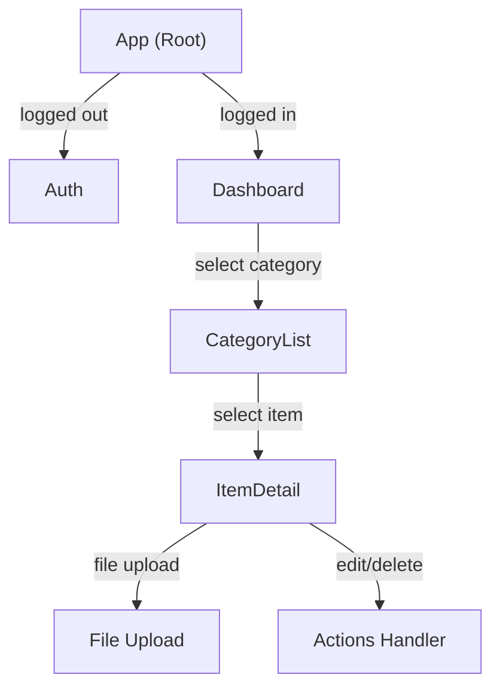

# ICOE Frontend Components

## Component Architecture



---

## Core Components

### 1. App Component

**File:** `src/App.js`

Root component managing authentication state and navigation.

```javascript
function App() {
  const [token, setToken] = useState(localStorage.getItem('token'));
  const [user, setUser] = useState(...);

  return (
    <div className="App">
      {!token ? <Auth /> : <Dashboard />}
    </div>
  );
}
```

**Responsibilities:**
- Check localStorage for existing token
- Toggle between Auth and Dashboard views
- Manage user session state
- Handle login/logout

**State:**
- `token` - JWT authentication token
- `user` - Current user object

**Props:** None (root component)

**Children:**
- `Auth` - Login/Register form
- `Dashboard` - Main application interface

---

### 2. Auth Component

**File:** `src/components/Auth.js`

Handles user registration and login.

```javascript
function Auth({ onLoginSuccess }) {
  const [isLogin, setIsLogin] = useState(true);
  const [email, setEmail] = useState('');
  const [password, setPassword] = useState('');
  const [username, setUsername] = useState('');
  const [error, setError] = useState('');
  // ...
}
```

**Responsibilities:**
- Display login/registration form
- Toggle between modes
- Validate user input
- Call API endpoints
- Handle authentication errors

**State:**
- `isLogin` - Toggle login/register mode
- `email` - Email input
- `password` - Password input
- `username` - Username (registration only)
- `error` - Error message display
- `loading` - Async operation state

**Props:**
- `onLoginSuccess(token, user)` - Callback on successful login

**API Calls:**
- `POST /api/auth/register` - New account
- `POST /api/auth/login` - User login

**Styling:** `Auth.css` - Centered form layout with gradient

---

### 3. Dashboard Component

**File:** `src/components/Dashboard.js`

Main application layout with sidebar navigation and content area.

```javascript
function Dashboard({ user, token, onLogout }) {
  const [categories, setCategories] = useState([]);
  const [selectedCategory, setSelectedCategory] = useState(null);
  const [selectedItem, setSelectedItem] = useState(null);
  const [items, setItems] = useState([]);
  // ...
}
```

**Responsibilities:**
- Display 6 category buttons in sidebar
- Manage category/item selection
- Coordinate data fetching
- Display welcome message or content
- Handle logout

**State:**
- `categories` - List of user's categories
- `selectedCategory` - Currently viewed category
- `selectedItem` - Currently selected item
- `items` - Items in selected category
- `loading` - Fetch operation state

**Props:**
- `user` - Current user object
- `token` - JWT token for API calls
- `onLogout()` - Logout callback

**Methods:**
- `fetchCategories()` - Load user's categories
- `createCategory(name)` - New category
- `selectCategory(category)` - Load category items
- `createItem(itemData)` - New item in category
- `updateItem(itemId, data)` - Modify item
- `deleteItem(itemId)` - Remove item

**API Calls:**
- `GET /api/categories`
- `POST /api/categories`
- `GET /api/categories/:categoryId/items`
- `POST /api/categories/:categoryId/items`
- `PUT /api/items/:itemId`
- `DELETE /api/items/:itemId`

**Children:**
- `CategoryList` - Item list and form
- `ItemDetail` - Selected item details

**Styling:** `Dashboard.css` - Sidebar layout, category buttons

---

### 4. CategoryList Component

**File:** `src/components/CategoryList.js`

Displays items in a category and form to add new items.

```javascript
function CategoryList({ 
  items, 
  selectedItem, 
  onSelectItem, 
  onCreateItem, 
  loading 
}) {
  const [showForm, setShowForm] = useState(false);
  const [formData, setFormData] = useState({...});
  // ...
}
```

**Responsibilities:**
- Display list of items
- Show add item form
- Handle item selection
- Display loading/empty states

**State:**
- `showForm` - Toggle item creation form
- `formData` - New item input fields

**Props:**
- `items` - Array of items to display
- `selectedItem` - Currently selected item
- `onSelectItem(item)` - Selection callback
- `onCreateItem(itemData)` - Create callback
- `loading` - Loading state

**Form Fields:**
- `title` - Item name (required)
- `description` - Details
- `contact_info` - Contact information
- `reference_number` - Reference/ID

**Features:**
- Click item to select
- Click "Add Item" to toggle form
- Form validation (title required)
- Display empty state message

**Styling:** `CategoryList.css` - Item cards, form styling

---

### 5. ItemDetail Component

**File:** `src/components/ItemDetail.js`

Displays detailed information for selected item and file management.

```javascript
function ItemDetail({ 
  item, 
  token, 
  onUpdate, 
  onDelete 
}) {
  const [isEditing, setIsEditing] = useState(false);
  const [formData, setFormData] = useState(item);
  const [files, setFiles] = useState([]);
  const [uploading, setUploading] = useState(false);
  // ...
}
```

**Responsibilities:**
- Display item details
- Toggle edit mode
- Update item information
- Upload files
- List uploaded files
- Delete files
- Delete entire item

**State:**
- `isEditing` - Edit mode toggle
- `formData` - Edited item data
- `files` - List of uploaded files
- `uploading` - File upload progress

**Props:**
- `item` - Item object to display
- `token` - JWT for API calls
- `onUpdate(itemId, data)` - Update callback
- `onDelete(itemId)` - Delete callback

**Methods:**
- `fetchFiles()` - Load files for item
- `handleUpdate()` - Save changes
- `handleDelete()` - Remove item
- `handleFileUpload(file)` - Upload document
- `handleDeleteFile(fileId)` - Remove file

**API Calls:**
- `GET /api/items/:itemId/files`
- `PUT /api/items/:itemId`
- `DELETE /api/items/:itemId`
- `POST /api/items/:itemId/upload`
- `DELETE /api/files/:fileId`

**Features:**
- Edit mode shows form, view mode shows information
- File upload with progress
- Download files via direct link
- Delete individual files
- Confirm before delete

**Styling:** `ItemDetail.css` - Form layout, file list, action buttons

---

## Component Data Flow

```
User Action
    ↓
Component Event Handler
    ↓
State Update (setState)
    ↓
API Call (fetch)
    ↓
Server Response
    ↓
Update Component State
    ↓
React Re-render
    ↓
UI Updates
```

### Example: Create Item Flow

```
1. User enters form data in CategoryList
2. User clicks "Create Item"
3. onCreateItem callback → Dashboard.createItem()
4. API: POST /api/categories/:categoryId/items
5. Response: { id: newId }
6. Update items state
7. Display new item in list
8. Success message (implicit)
```

### Example: Upload File Flow

```
1. User selects file in ItemDetail
2. handleFileUpload() triggered
3. Create FormData with file
4. API: POST /api/items/:itemId/upload
5. Response: { id, url, filename }
6. Update files state
7. File appears in file list
8. Display download link
```

---

## State Management

### Global State (App.js)
- `token` - JWT token (stored in localStorage)
- `user` - User profile data

### Component State (Dashboard.js)
- `categories` - All user categories
- `selectedCategory` - Active category
- `selectedItem` - Selected item
- `items` - Items in category
- `error` - Error messages
- `loading` - Async state

### Local Component State
Each component manages its own UI state:
- Form visibility (showForm)
- Edit mode (isEditing)
- Form inputs
- Async operations (uploading)

---

## Styling Architecture

### Global Styles (`index.css`)
- CSS variables for colors
- Base elements (button, input, textarea)
- Utility classes (.container, .card, .error)

### Component Styles
Each component has a `.css` file:

**Color Scheme:**
- Primary: `#667eea` (Purple)
- Secondary: `#764ba2` (Dark Purple)
- Backgrounds: `#f5f5f5`, `#ffffff`
- Accents: `#d32f2f` (Red for delete), `#388e3c` (Green for success)

**Layout:**
- Flexbox for alignment
- Mobile-first responsive design
- Sidebar + content layout

---

## Form Handling

### Item Form (CategoryList)
```javascript
{
  title: string,           // Required
  description: string,     // Optional
  contact_info: string,    // Optional
  reference_number: string // Optional
}
```

### Edit Item Form (ItemDetail)
Same structure as item form.

### Validation
- Client-side: Required fields shown with `required` attribute
- Server-side: Additional validation in API

---

## Future Component Plans

### Phase 2
- **PermissionList** - Manage user access
- **SharedWith** - Show who has access
- **InviteUser** - Send access invitations
- **AuditLog** - View change history

### Phase 3
- **Search** - Search across items
- **Export** - Export to PDF/CSV
- **ImportData** - Bulk import
- **Settings** - User preferences
- **MobileNav** - Mobile menu

---

## Performance Optimizations

### Current
- React hooks (minimal re-renders)
- Lazy loading files on demand
- Conditional rendering

### Future
- React.memo() for expensive components
- useCallback for event handlers
- Code splitting with React.lazy()
- Image optimization
- Service Worker caching

---

## Testing Strategy

### Component Tests (future)
```javascript
// Test Auth Login
test('submits login form', () => {
  render(<Auth onLoginSuccess={mockCallback} />);
  // Fill form and submit
  // Verify API call
  // Verify callback
});
```

### Integration Tests (future)
```javascript
// Test full user flow
test('complete item creation flow', () => {
  // Login
  // Select category
  // Create item
  // Verify item displays
});
```

### E2E Tests (future)
Cypress/Playwright for full application testing.
