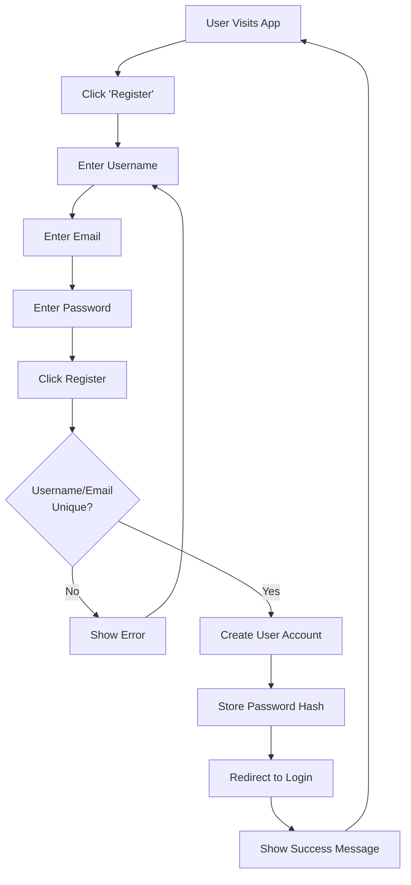
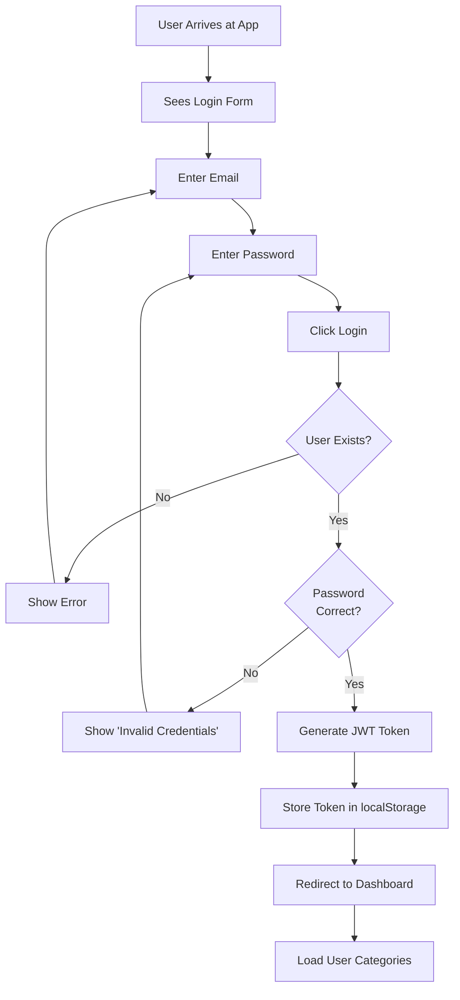
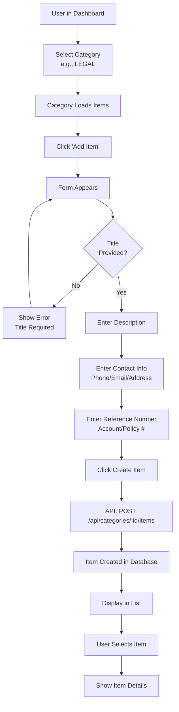
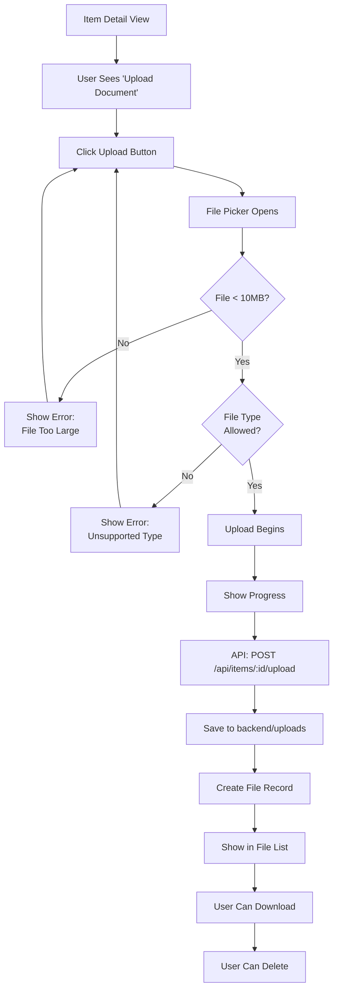
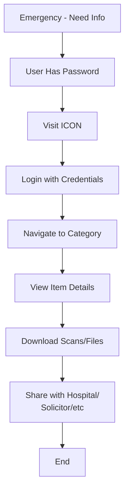
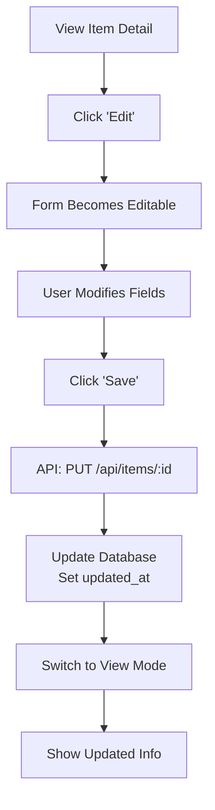
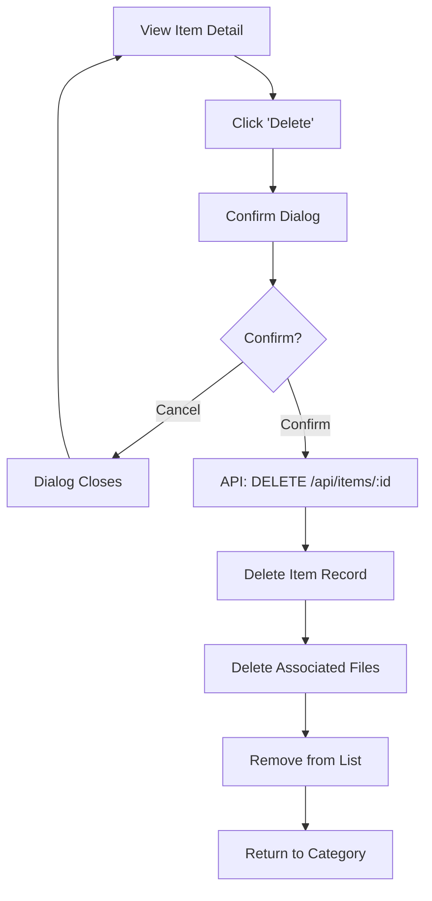
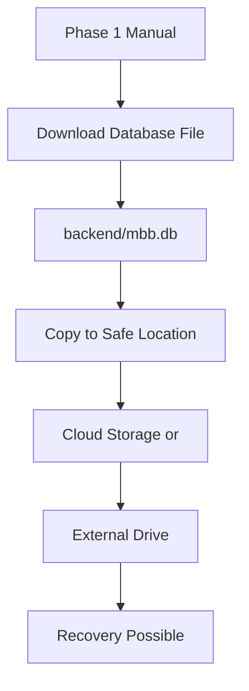

# ICON User Flows & Workflows

## User Journey Diagram

```mermaid
userJourney
    title ICON User Journey - Emergency Info Setup

    section Discovery
      Understand Purpose: 5: user
      Visit App: 5: user

    section Registration
      Create Account: 3: user
      Confirm Email: 4: user

    section Initial Setup
      Choose Category: 5: user
      Add First Item: 4: user
      Enter Details: 3: user

    section Data Population
      Upload Document: 5: user
      Add Multiple Items: 5: user
      Organize Data: 4: user

    section Access
      Share with Family: 3: user
      Invite Recipients: 3: user
      Emergency Sharing: 5: user

    section Review
      Verify Data: 4: user
      Test Access: 5: user
      Plan Updates: 4: user
```

---

## Core User Flows

### Flow 1: New User Registration



**Key Steps:**
1. User arrives at app
2. Clicks "Register" toggle
3. Enters username (unique)
4. Enters email (unique)
5. Enters password
6. Backend validates & creates account
7. Redirected to login form
8. User logs in with new credentials

**Error Handling:**
- Duplicate username → "Username already exists"
- Duplicate email → "Email already registered"
- Invalid email format → "Invalid email address"
- Short password → "Password too short"

---

### Flow 2: User Login



**Key Steps:**
1. User enters email
2. User enters password
3. Backend verifies credentials against hashed password
4. If correct: Generate JWT token
5. Frontend stores token in localStorage
6. Redirect to Dashboard
7. Dashboard loads user's categories

**Token Storage:**
- Stored in browser localStorage
- Included in all API requests
- Persists across page refreshes
- Cleared on logout

---

### Flow 3: Adding Emergency Information



**Key Steps:**
1. User selects category (auto-creates if needed)
2. Category displays items list
3. User clicks "Add Item"
4. Form appears with fields:
   - Title (required) - e.g., "Smith & Associates Law Firm"
   - Description (optional) - "Our family lawyer"
   - Contact Info (optional) - "Tel: 020-3456-7890"
   - Reference Number (optional) - "LAW001"
5. User submits form
6. Item created in database
7. Item appears in list
8. User can select to view details

**Validation:**
- Title: Required, max 255 chars
- Description: Max 5000 chars
- Contact Info: Max 500 chars
- Reference Number: Max 100 chars

---

### Flow 4: Uploading Documents



**Supported File Types:**
- PDF
- Images: JPEG, PNG, GIF, WEBP
- Office: DOC, DOCX, XLS, XLSX
- Text: TXT, RTF

**File Constraints:**
- Max size: 10MB per file
- No limit on files per item
- Stored with timestamp prefix

**File Operations:**
- Upload: Drag-drop or file picker
- Download: Click link in file list
- Delete: Click X button next to filename

---

### Flow 5: Emergency Access (Phase 1: Manual)



**Phase 1 Workflow:**
1. Emergency responder has account login
2. Logs into system
3. Navigates to appropriate category
4. Views and downloads documents
5. Shares via email/print

**Phase 2 Enhancement:**
- Shared access links
- Limited-time codes
- Notifications to recipients

---

### Flow 6: Data Management - Edit & Delete

#### Edit Item



**Edit Workflow:**
1. User views item details
2. Clicks "Edit" button
3. Form fields become editable
4. User modifies one or more fields
5. Clicks "Save"
6. API updates database
7. Timestamp updated automatically
8. Form switches to view-only
9. New data displayed

#### Delete Item



**Delete Workflow:**
1. User clicks "Delete" button
2. Confirmation dialog shown
3. If confirmed:
   - Item deleted from database
   - Associated files deleted
   - Category list updated
   - User returns to empty list

---

### Flow 7: Complete Data Backup



**Phase 1 Backup:**
1. Database stored locally at `backend/mbb.db`
2. User manually copies file
3. Store on cloud drive or external drive
4. Can restore by copying back

**Phase 2 Automatic Backup:**
- Daily automatic backups
- Cloud storage integration
- Versioning/recovery points

---

## Category-Specific Workflows

### LEGAL Category Workflow

```
1. Add Solicitor Info
   └─ Name, Address, Phone, Email
   └─ Upload: Will, Power of Attorney, Deeds

2. Add Reference Numbers
   └─ Policy numbers
   └─ Court references

3. Upload Key Documents
   └─ Will scan
   └─ POA documents
   └─ Trust documents
```

### HEALTH Category Workflow

```
1. Add GP Details
   └─ Surgery name, address, phone
   └─ NHS number

2. Add Hospital/Specialist Info
   └─ Hospital name, department
   └─ Consultant name

3. Add Carer Information
   └─ Name, relationship, contact

4. Upload Medical Documents
   └─ Prescriptions
   └─ Test results
   └─ Medical history summary
```

### FINANCE Category Workflow

```
1. Add Bank Account Info
   └─ Bank name, sort code
   └─ Account number (last 4 digits)
   └─ Branch address/phone

2. Add Investment Info
   └─ ISA provider, reference
   └─ Pension provider, reference

3. Add Loan Information
   └─ Lender, account number
   └─ Amount, term

4. Upload Documents
   └─ Bank statements
   └─ Pension statements
   └─ Mortgage details
```

---

## Data Entry Guidelines

### Best Practices

1. **Organization**
   - One item per provider/service
   - Clear, descriptive titles
   - Consistent naming convention

2. **Contact Information**
   - Area codes in parentheses: (020)
   - Include available hours if relevant
   - Multiple contacts (main + backup)

3. **Reference Numbers**
   - Account number
   - Policy number
   - Member/Customer number
   - Unique identifier

4. **Document Uploads**
   - Upload current version
   - Name files descriptively
   - Keep 1-2 most recent versions

5. **Updates**
   - Review annually
   - Update after life changes
   - Upload new documents when available

---

## Exception Handling

### What if user forgets password?

**Phase 1:**
- No recovery mechanism
- Account locked (future: password reset email)

**Phase 2:**
- Email password reset link
- Security questions
- Account recovery options

### What if file upload fails?

1. Show error message
2. Suggest retry
3. Check file size
4. Check internet connection

### What if item has no files?

- Allow item to exist without files
- Text-only entries supported
- Scans optional

---

## Emergency Scenario

### Scenario: Medical Emergency

```
1. Family member needs access
2. Goes to hospital/doctor
3. Provides ICON credentials
4. Hospital staff logs in
5. Navigates to HEALTH category
6. Downloads current medications list
7. Checks medical history document
8. Shares with treating physician
9. Physician has critical info
```

### Scenario: Death/Incapacity

```
1. Solicitor needs to access
2. Uses special access code (Phase 2)
3. Views LEGAL documents
4. Accesses FINANCE information
5. Reviews insurance policies
6. Contacts beneficiaries
```

---

## Phase 2 Enhancements

### User Flows to Add

1. **Invite & Share**
   - Send invitation email
   - Grant temporary/permanent access
   - Revoke access anytime

2. **Emergency Lock**
   - One-click emergency unlock code
   - Send SMS/email to recipients
   - Time-limited access

3. **Audit Trail**
   - Who accessed when
   - What was viewed/downloaded
   - Email notifications

4. **Data Export**
   - Export full backup
   - PDF report generation
   - Email delivery

---

## User Support Scenarios

### New User First Steps

```
1. Register account
2. Create first category (HEALTH)
3. Add GP information
4. Upload GP contact document
5. Add hospital information
6. Test category navigation
7. Explore other categories
8. Schedule full population
```

### Batch Data Entry

```
For gathering all info:
1. Print templates (Phase 2)
2. Fill in by category
3. Scan documents
4. Enter into system
5. Organize by category
6. Review completeness
7. Share access
```

### Ongoing Maintenance

```
Set calendar reminders:
- Q1: Review LEGAL documents
- Q2: Update FINANCE accounts
- Q3: Verify HEALTH contacts
- Q4: Complete data audit
```
