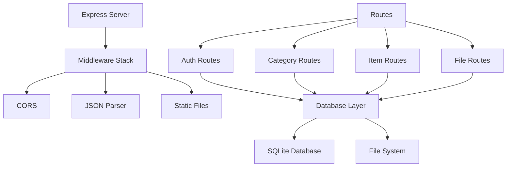

# ICON Backend Implementation

## Server Architecture



---

## File Structure

```
backend/
├── server.js           # Main application & routes
├── package.json        # Dependencies
├── mbb.db             # SQLite database (created at runtime)
├── uploads/           # Uploaded files directory
│   └── [timestamp-filename]
└── .env               # Environment variables (create manually)
```

---

## Dependencies

### Production Dependencies

```json
{
  "express": "^4.18.2",          // Web framework
  "bcryptjs": "^2.4.3",          // Password hashing
  "jsonwebtoken": "^9.0.0",      // JWT generation
  "sqlite3": "^5.1.6",           // Database
  "multer": "^1.4.5-lts.1",      // File uploads
  "cors": "^2.8.5"               // Cross-origin requests
}
```

### How Each is Used

**Express:** HTTP server, routing, middleware

**bcryptjs:** 
- Password hashing on registration
- Password verification on login
- Prevents plaintext password storage

**JWT (jsonwebtoken):**
- Generate tokens on login
- Verify tokens on protected routes
- Decode user info from token

**sqlite3:**
- Database connection
- Query execution
- Transaction management

**Multer:**
- Handle multipart/form-data
- File validation
- Disk storage configuration

**CORS:**
- Allow frontend (localhost:3000) to call backend (localhost:5000)
- Production: whitelist specific domains

---

## Route Organization

### Authentication Routes (`/api/auth/*`)

#### POST /api/auth/register
```javascript
app.post('/api/auth/register', (req, res) => {
  // 1. Validate input
  if (!username || !email || !password) {
    return res.status(400).json({ error: 'Missing fields' });
  }

  // 2. Hash password
  const hashedPassword = bcrypt.hashSync(password, 10);

  // 3. Insert into database
  db.run(
    'INSERT INTO users (username, email, password) VALUES (?, ?, ?)',
    [username, email, hashedPassword],
    (err) => {
      if (err) {
        return res.status(400).json({ error: 'User exists' });
      }
      res.status(201).json({ message: 'User registered' });
    }
  );
});
```

**Flow:**
1. Validate required fields
2. Check username/email uniqueness (handled by DB constraint)
3. Hash password with bcrypt (10 salt rounds)
4. Insert user record
5. Return success or error

#### POST /api/auth/login
```javascript
app.post('/api/auth/login', (req, res) => {
  // 1. Find user by email
  db.get('SELECT * FROM users WHERE email = ?', [email], (err, user) => {
    if (!user) {
      return res.status(401).json({ error: 'Invalid credentials' });
    }

    // 2. Compare password hash
    if (!bcrypt.compareSync(password, user.password)) {
      return res.status(401).json({ error: 'Invalid credentials' });
    }

    // 3. Generate JWT token
    const token = jwt.sign(
      { id: user.id, email: user.email },
      JWT_SECRET,
      { expiresIn: '24h' }
    );

    // 4. Return token and user info
    res.json({ token, user });
  });
});
```

**Flow:**
1. Query database for user by email
2. If not found → 401 Unauthorized
3. Compare provided password with stored hash
4. If no match → 401 Unauthorized
5. Generate JWT token with user info
6. Return token to frontend
7. Frontend stores token in localStorage

---

### Authentication Middleware

```javascript
function authenticateToken(req, res, next) {
  const authHeader = req.headers['authorization'];
  const token = authHeader && authHeader.split(' ')[1]; // Extract token

  if (!token) return res.sendStatus(401); // No token = unauthorized

  jwt.verify(token, JWT_SECRET, (err, user) => {
    if (err) return res.sendStatus(403); // Invalid token = forbidden
    req.user = user; // Attach to request
    next(); // Continue to route handler
  });
}

// Usage on protected routes:
app.get('/api/categories', authenticateToken, (req, res) => {
  // req.user now contains { id, email }
});
```

**Token Flow:**
1. Frontend sends: `Authorization: Bearer <token>`
2. Middleware extracts token
3. Verifies signature using JWT_SECRET
4. Extracts user info from token payload
5. Attaches to `req.user`
6. Route handler can use `req.user.id`

---

### Category Routes

#### GET /api/categories
```javascript
app.get('/api/categories', authenticateToken, (req, res) => {
  db.all(
    'SELECT * FROM categories WHERE user_id = ?',
    [req.user.id],
    (err, rows) => {
      if (err) return res.status(500).json({ error: err.message });
      res.json(rows || []);
    }
  );
});
```

**User Isolation:** Query only categories owned by `req.user.id`

#### POST /api/categories
```javascript
app.post('/api/categories', authenticateToken, (req, res) => {
  const { category_name } = req.body;

  db.run(
    'INSERT INTO categories (user_id, category_name) VALUES (?, ?)',
    [req.user.id, category_name],
    function(err) {
      if (err) return res.status(500).json({ error: err.message });
      res.status(201).json({ 
        id: this.lastID, 
        category_name,
        user_id: req.user.id 
      });
    }
  );
});
```

**Auto-create on Frontend:** If category doesn't exist, create it

---

### Item Routes

#### POST /api/categories/:categoryId/items
```javascript
app.post('/api/categories/:categoryId/items', authenticateToken, (req, res) => {
  const { title, description, contact_info, reference_number } = req.body;
  const { categoryId } = req.params;

  // Validate title (required)
  if (!title) {
    return res.status(400).json({ error: 'Title required' });
  }

  // Insert item
  db.run(
    `INSERT INTO items 
     (category_id, user_id, title, description, contact_info, reference_number)
     VALUES (?, ?, ?, ?, ?, ?)`,
    [categoryId, req.user.id, title, description, contact_info, reference_number],
    function(err) {
      if (err) return res.status(500).json({ error: err.message });
      res.status(201).json({ id: this.lastID });
    }
  );
});
```

**Key Security:** Insert with both `category_id` AND `user_id` to maintain ownership

#### PUT /api/items/:itemId
```javascript
app.put('/api/items/:itemId', authenticateToken, (req, res) => {
  const { title, description, contact_info, reference_number } = req.body;
  const { itemId } = req.params;

  // Verify owner before updating
  db.run(
    `UPDATE items 
     SET title = ?, description = ?, contact_info = ?, reference_number = ?,
         updated_at = CURRENT_TIMESTAMP
     WHERE id = ? AND user_id = ?`,
    [title, description, contact_info, reference_number, itemId, req.user.id],
    function(err) {
      if (err) return res.status(500).json({ error: err.message });
      if (this.changes === 0) {
        return res.status(404).json({ error: 'Item not found' });
      }
      res.json({ message: 'Item updated' });
    }
  );
});
```

**Key Security:** Only update if `user_id` matches (owner verification)

---

### File Upload Routes

#### POST /api/items/:itemId/upload
```javascript
// Multer configuration
const storage = multer.diskStorage({
  destination: (req, file, cb) => {
    cb(null, path.join(__dirname, 'uploads'));
  },
  filename: (req, file, cb) => {
    // Timestamp prevents filename collisions
    cb(null, Date.now() + '-' + file.originalname);
  }
});
const upload = multer({ storage });

// Route handler
app.post('/api/items/:itemId/upload', authenticateToken, upload.single('file'), 
  (req, res) => {
    if (!req.file) {
      return res.status(400).json({ error: 'No file' });
    }

    // Store file metadata in database
    db.run(
      `INSERT INTO files (item_id, filename, original_filename, filepath)
       VALUES (?, ?, ?, ?)`,
      [req.params.itemId, req.file.filename, req.file.originalname, req.file.path],
      function(err) {
        if (err) return res.status(500).json({ error: err.message });
        res.status(201).json({
          id: this.lastID,
          filename: req.file.filename,
          original_filename: req.file.originalname,
          url: `/uploads/${req.file.filename}`
        });
      }
    );
  }
);
```

**File Storage:**
- Physical: `backend/uploads/<timestamp-filename>`
- Database: Record with original name + stored filename
- Access: Direct URL e.g. `/uploads/1705314000000-document.pdf`

---

### Database Initialization

```javascript
function initializeDatabase() {
  db.serialize(() => {
    // Create all tables if they don't exist
    
    db.run(`CREATE TABLE IF NOT EXISTS users (...)`);
    db.run(`CREATE TABLE IF NOT EXISTS categories (...)`);
    db.run(`CREATE TABLE IF NOT EXISTS items (...)`);
    db.run(`CREATE TABLE IF NOT EXISTS files (...)`);
    db.run(`CREATE TABLE IF NOT EXISTS permissions (...)`);
    
    // Optional: Create indexes for performance
    db.run(`CREATE INDEX IF NOT EXISTS idx_items_user 
            ON items(user_id)`);
  });
}

// Call on startup
initializeDatabase();
app.listen(PORT, () => {
  console.log(`Server running on port ${PORT}`);
});
```

---

## Error Handling

### HTTP Status Codes

```javascript
// 200 OK - Successful GET/PUT
res.status(200).json({ message: 'Success' });

// 201 Created - Successful POST
res.status(201).json({ id: 1 });

// 400 Bad Request - Invalid input
res.status(400).json({ error: 'Missing required field' });

// 401 Unauthorized - Missing/invalid token
res.status(401).json({ error: 'Unauthorized' });

// 403 Forbidden - Valid token but no permission
res.status(403).json({ error: 'Access denied' });

// 404 Not Found - Resource doesn't exist
res.status(404).json({ error: 'Item not found' });

// 500 Server Error - Unexpected error
res.status(500).json({ error: 'Internal server error' });
```

### Try-Catch Pattern (Future)

```javascript
app.post('/api/items', authenticateToken, async (req, res) => {
  try {
    const { title, description } = req.body;
    
    if (!title) {
      return res.status(400).json({ error: 'Title required' });
    }
    
    // Perform operation
    const result = await db.run(...);
    
    res.status(201).json(result);
  } catch (err) {
    console.error('Error creating item:', err);
    res.status(500).json({ error: 'Internal server error' });
  }
});
```

---

## Security Best Practices

### Current (Phase 1)

- ✓ Password hashing with bcryptjs
- ✓ JWT token-based authentication
- ✓ CORS restricted to localhost
- ✓ Token expiration (24 hours)
- ✓ User isolation via user_id checks

### To Implement (Phase 2)

- [ ] HTTPS/TLS encryption
- [ ] Rate limiting (express-rate-limit)
- [ ] File type validation
- [ ] File size limits
- [ ] SQL injection protection (parameterized queries ✓ already using)
- [ ] CSRF tokens
- [ ] Secure headers (helmet.js)
- [ ] API versioning

### Helmet Setup (Future)

```javascript
const helmet = require('helmet');
app.use(helmet()); // Adds security headers
```

---

## Performance Optimization

### Database Indexes (Current)

```sql
CREATE INDEX idx_categories_user_id ON categories(user_id);
CREATE INDEX idx_items_user_id ON items(user_id);
CREATE INDEX idx_items_category_id ON items(category_id);
CREATE INDEX idx_files_item_id ON files(item_id);
```

### Query Optimization

```javascript
// Good: Single query with JOIN
db.all(`
  SELECT items.* FROM items
  JOIN categories ON items.category_id = categories.id
  WHERE categories.user_id = ?
`, [userId]);

// Avoid: N+1 queries (multiple round trips)
// - Query categories
// - Loop and query items for each category
```

---

## Logging & Debugging

### Console Logging (Currently Basic)

```javascript
console.log('Server running on port ' + PORT);
console.error('Database error:', err);
```

### Future Logging

```javascript
const winston = require('winston');
const logger = winston.createLogger({
  level: 'info',
  format: winston.format.json(),
  transports: [
    new winston.transports.File({ filename: 'error.log', level: 'error' }),
    new winston.transports.File({ filename: 'combined.log' })
  ]
});
```

---

## Testing Strategy

### Unit Tests (Future)

```javascript
// Example: Test password hashing
describe('Password hashing', () => {
  it('should hash password correctly', () => {
    const hash = bcrypt.hashSync('password', 10);
    expect(bcrypt.compareSync('password', hash)).toBe(true);
  });
});
```

### API Tests (Future)

```javascript
describe('POST /api/auth/login', () => {
  it('should return token on valid credentials', async () => {
    const response = await request(app)
      .post('/api/auth/login')
      .send({ email: 'test@example.com', password: 'pass' });
    expect(response.status).toBe(200);
    expect(response.body.token).toBeDefined();
  });
});
```

---

## Database Backup & Migration

### SQLite to PostgreSQL (Phase 2)

1. Export SQLite data
2. Create PostgreSQL schemas
3. Import data
4. Update connection string
5. Test all queries

### Backup Command

```bash
# Windows
copy backend\mbb.db backup-mbb.db

# Mac/Linux
cp backend/mbb.db backup-mbb.db
```

---

## Environment Variables

### Create `.env` file

```
NODE_ENV=development
PORT=5000
JWT_SECRET=your-secret-key-change-in-production
DB_PATH=./mbb.db
MAX_FILE_SIZE=10485760
ALLOWED_ORIGINS=http://localhost:3000
```

### Usage

```javascript
require('dotenv').config();
const PORT = process.env.PORT || 5000;
const JWT_SECRET = process.env.JWT_SECRET;
```

---

## Deployment Checklist

- [ ] Change JWT_SECRET to strong value
- [ ] Set NODE_ENV=production
- [ ] Enable HTTPS
- [ ] Configure CORS for production domain
- [ ] Set up database migrations
- [ ] Configure backup strategy
- [ ] Set up error logging
- [ ] Enable rate limiting
- [ ] Configure reverse proxy (nginx)
- [ ] Set up CI/CD pipeline
